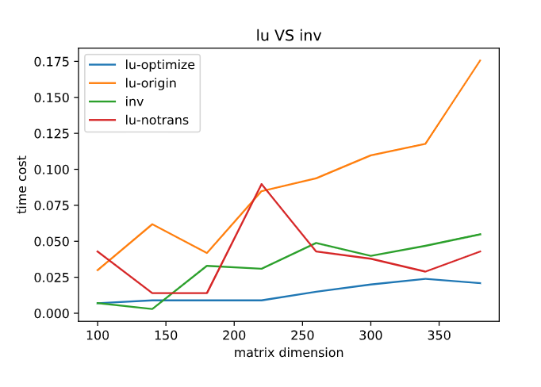
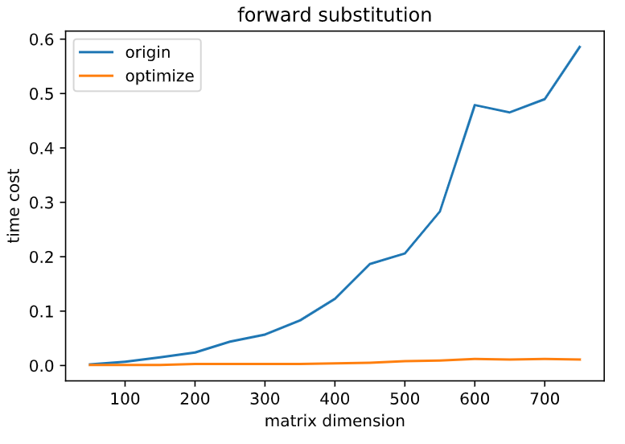
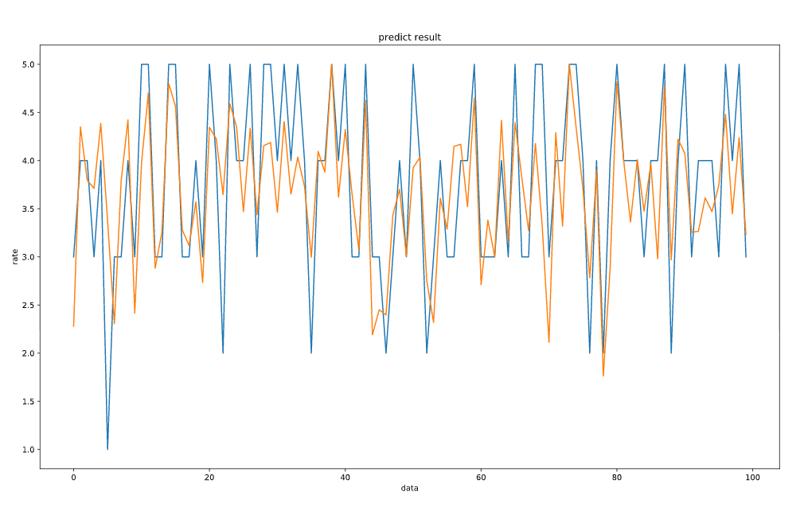
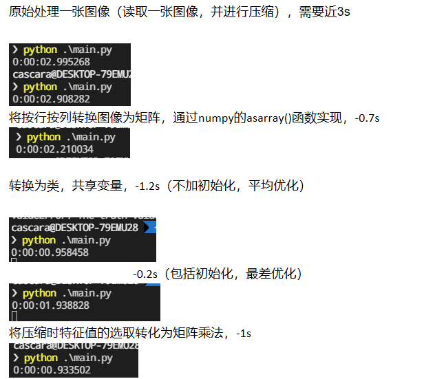

# 数据科学基础

## 笔记部分——矩阵分解

实现矩阵分解的典型算法，并尝试进行优化。

### [LU](lu.ipynb)
利用scipy内置的lu函数，进行求解矩阵的应用
独立实现backward substitution与forward substitution，并通过实验验证：在优化算法后，运算效率高于矩阵求逆
)

#### 优化方法

1. 利用矩阵并行运算性质，将并行运算同步实现，将时间复杂度由$O(n^2)$降低到$O(n)$提高backward/forward substitution的效率

2. 利用LU(PLU)中置换矩阵P的性质，有$P^{-1}=P^{T}$ 将求逆运算转换为求转置

### [QR](QR.ipynb))
独立实现：
1. 通过 Gram–Schmidt 进行QR分解
2. 利用QR分解进行特征根的求取（QR algorithm）

#### 优化方法
发现最初独立实现的QR效率远低于numpy的内置函数，通过分析，发现 Gram–Schmidt 的效率与行列向量数目相关

### [SVM](Recommend)
利用已有方法 [NoisyWinds/Recommend](https://github.com/NoisyWinds/Recommend) 进行SVD的实际应用，包括：
- [推荐系统](Recommend)
- [图像压缩](Recommend/matrix_factorization/svd/image_denoising)

并独立实现：
- 对推荐系统的处理进行数据可视化
  
- 对图像压缩进行优化，效率极大提高
  

